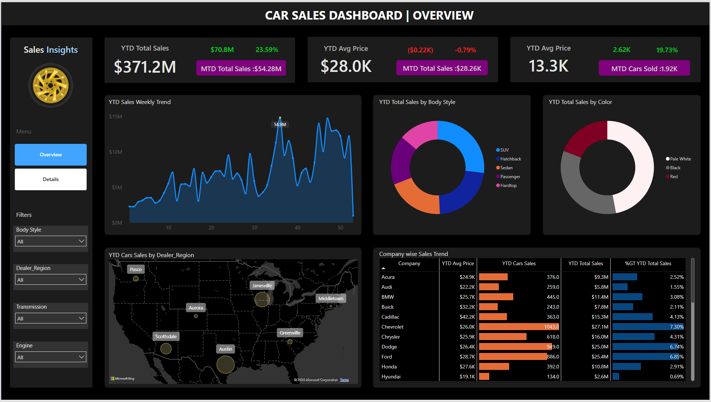
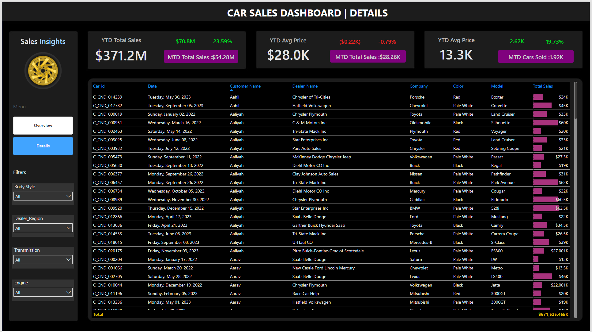

# 🚗 Car Sales Dashboard

An interactive Power BI dashboard designed to analyze car sales performance, monitor key business metrics, and support data-driven decision-making.

## 📊 Project Overview

This dashboard provides a comprehensive analysis of car sales data through visual reports and KPI tracking. It enables users to explore sales trends, customer purchasing behavior, vehicle characteristics, and regional performance.

The report consists of two main pages:

- **Overview Dashboard**
- **Details Dashboard**

---

## 🎯 Key Objectives

- Monitor Year-to-Date (YTD) sales performance
- Track Month-to-Date (MTD) sales metrics
- Analyze sales trends over time
- Compare performance across vehicle categories
- Identify top-performing regions and manufacturers
- Provide detailed transaction-level insights

---

## 📈 Dashboard Features

### 1. Overview Page

The Overview page presents high-level business metrics and performance indicators.

#### KPI Cards
- YTD Total Sales
- YTD Average Price
- YTD Cars Sold
- MTD Total Sales
- Sales Growth Percentage

#### Visualizations
- Weekly Sales Trend Analysis
- Sales by Body Style
- Sales by Vehicle Color
- Regional Sales Distribution Map
- Company-wise Sales Performance Table

#### Interactive Filters
- Body Style
- Dealer Region
- Transmission Type
- Engine Type

---

### 2. Details Page

The Details page provides transaction-level data for deeper analysis.

#### Included Information
- Car ID
- Sale Date
- Customer Name
- Dealer Name
- Company/Brand
- Vehicle Color
- Vehicle Model
- Total Sales Amount

Users can apply filters to drill down into specific segments and explore individual sales records.

---

## 🛠 Tools & Technologies

- **Power BI**
- Power Query
- DAX (Data Analysis Expressions)
- Data Modeling
- Interactive Visualizations

---

## 📂 Project Structure

```text
car-sales-dashboard/
│
├── dashboard/
│   └── Car Sales Analysis Project.pbix
│
├── data/
│   ├── raw/
│   └── processed/
│
├── images/
│   ├── overview_page.png
│   └── details_page.png
│
└── README.md
```

---

## 📸 Dashboard Preview

### Overview Dashboard



### Details Dashboard



---

## 📊 Business Insights Generated

- Sales performance trends throughout the year
- Most popular vehicle body styles
- Best-selling vehicle colors
- Regional sales distribution
- Top-performing automotive brands
- Average vehicle selling price analysis

---

## 🚀 Getting Started

1. Clone this repository:

```bash
git clone https://github.com/your-username/car-sales-dashboard.git
```

2. Open the `.pbix` file in Power BI Desktop.

3. Refresh the data source if needed.

4. Explore the dashboard using filters and slicers.

---

## 📌 Future Improvements

- Customer segmentation analysis
- Sales forecasting models
- Profitability analysis
- Manufacturer comparison dashboard
- Advanced drill-through reports

---

## 📄 License

This project is licensed under the MIT License.
